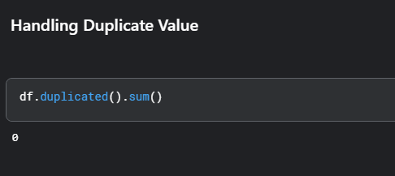
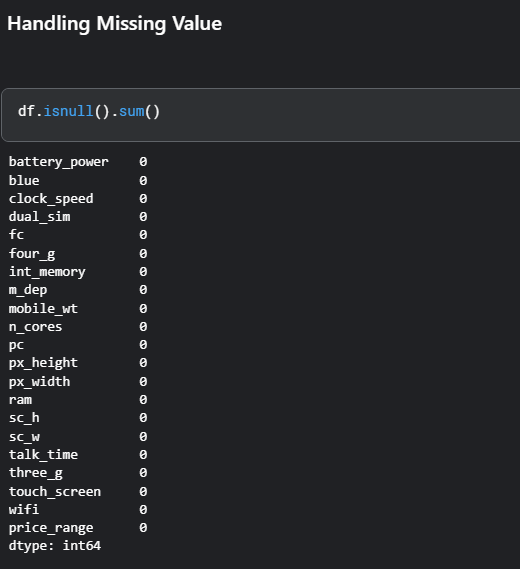
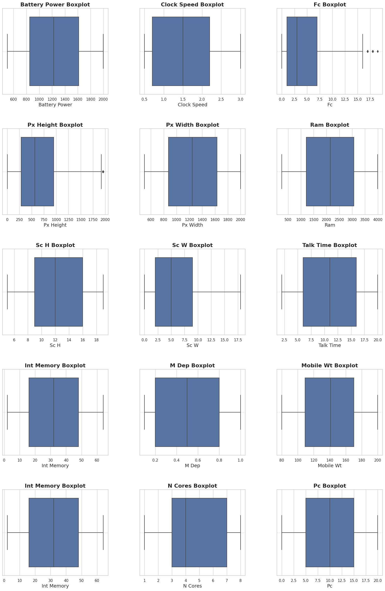
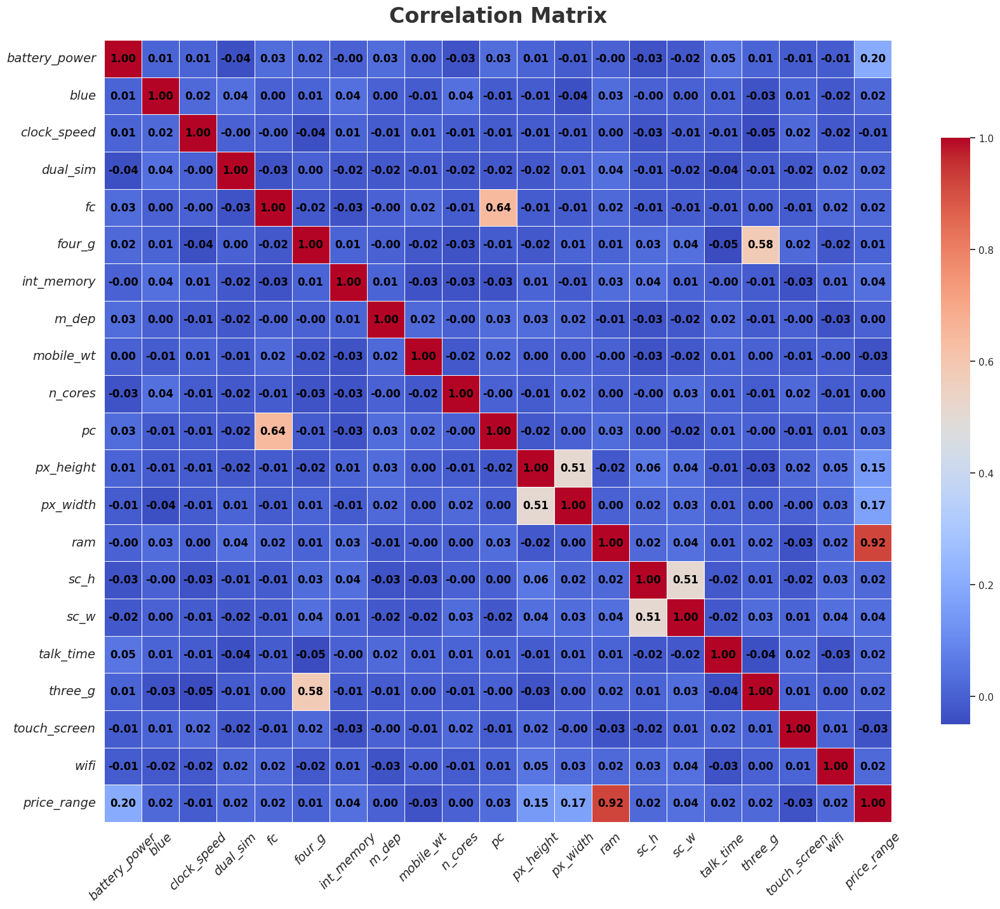
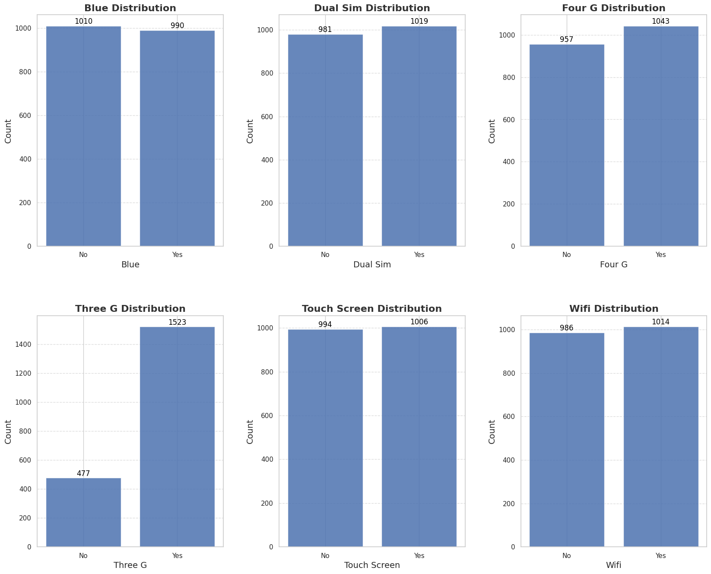
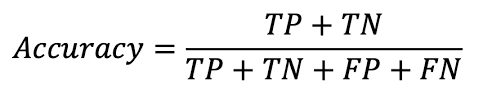
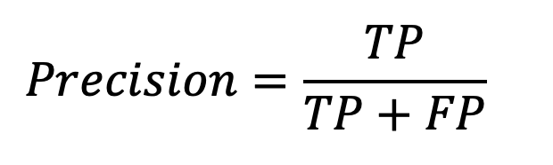
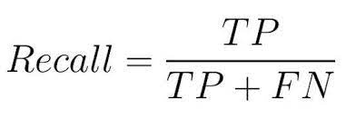
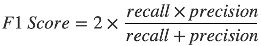
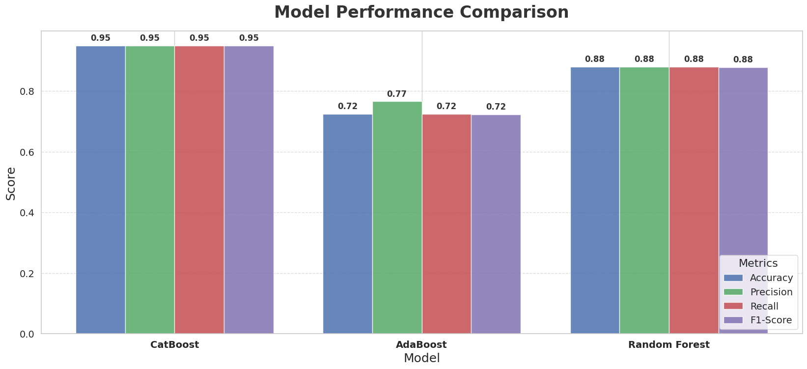

---
## Laporan Proyek Machine Learning - Jabir Muktabir
---

## Domain Proyek

Pada era persaingan ketat di industri ponsel, perusahaan baru sulit bersaing dengan merek ternama seperti Apple dan Samsung. Estimasi harga yang tepat menjadi faktor kunci dalam menentukan daya saing produk. Bob, seorang pengusaha yang baru memulai bisnis ponsel, ingin mengatasi tantangan ini dengan menemukan hubungan antara fitur ponsel (seperti RAM, memori internal, dll.) dan rentang harga jual.

**Mengapa masalah ini penting?**

- Estimasi harga yang akurat dapat membantu dalam **strategi pemasaran** dan **penentuan segmentasi pasar** yang tepat.
- Meminimalkan **kerugian finansial** akibat salah penetapan harga.

**Referensi**:

- [K-BEST SELECTION UNTUK MENINGKATKAN KINERJA ARTIFICIAL NEURAL NETWORK DALAM MEMPREDIKSI RANGE HARGA PONSEL](https://ejournal.nusamandiri.ac.id/index.php/inti/article/view/5554)
- [ANALISIS PENGARUH CITRA MERK, KUALITAS PRODUK, HARGA DAN PROMOSI TERHADAP KEPUTUSAN PEMBELIAN SMARTPHONE SAMSUNG DI MAKASSAR](https://ojs.unsulbar.ac.id/index.php/mandar/article/view/864)

---

## Business Understanding

### Problem Statements

1. **Bagaimana menentukan rentang harga ponsel berdasarkan fitur-fitur teknis?**
2. **Algoritma machine learning apa yang paling efektif untuk mengklasifikasikan rentang harga ponsel?**
3. **Bagaimana performa model dalam hal akurasi, presisi, recall, dan F1-Score pada data ini?**

---

### Goals

- **Menentukan hubungan antara fitur teknis ponsel dan rentang harga.**
- **Membangun model klasifikasi yang akurat untuk mengelompokkan harga ponsel.**
- **Mengevaluasi performa model menggunakan metrik akurasi, presisi, recall, dan F1-Score.**

---

### Solution Statements

- Menggunakan **tiga algoritma klasifikasi**:
  1. **CatBoost**: Algoritma boosting yang kuat dalam menangani fitur kategori dan **overfitting yang rendah**.
  2. **AdaBoost**: Algoritma boosting adaptif yang cocok untuk **imbalance data**.
  3. **Random Forest**: Algoritma ensemble dengan **interpretabilitas yang baik** dan **stabil terhadap outlier**.
- **Hyperparameter tuning** pada masing-masing model untuk **memaksimalkan performa**.
- **Metrik evaluasi yang digunakan**: Akurasi, Presisi, Recall, dan F1-Score.

---

## Data Understanding

Dataset yang digunakan adalah **Mobile Price Classification Dataset**, yang berisi informasi mengenai spesifikasi teknis ponsel dan rentang harga.  
Dataset dapat diakses di: [Mobile Price Classification Dataset](https://www.kaggle.com/datasets/iabhishekofficial/mobile-price-classification)

Dataset tersebut memiliki 21 kolom/variabel dengan jumlah baris/data sebanyak 2000 data. Dibawah ini merupakan variabel-variabel dalam dataset **Mobile Price Classification**

### Variabel-variabel pada dataset:

- **battery_power** = Total energi yang dapat disimpan oleh baterai dalam satu kali pengisian daya, diukur dalam mAh
- **blue** = Apakah memiliki fitur Bluetooth atau tidak
- **clock_speed** = Kecepatan prosesor dalam mengeksekusi instruksi
- **dual_sim** = Apakah mendukung dual SIM atau tidak
- **fc** = Megapiksel kamera depan
- **four_g** = Apakah mendukung 4G atau tidak
- **int_memory** = Memori internal dalam Gigabyte
- **m_dep** = Ketebalan ponsel dalam cm
- **mobile_wt** = Berat ponsel
- **n_cores** = Jumlah inti (core) pada prosesor
- **pc** = Megapiksel kamera utama
- **px_height** = Resolusi tinggi piksel layar
- **px_width** = Resolusi lebar piksel layar
- **ram** = Random Access Memory dalam Megabyte
- **sc_h** = Tinggi layar ponsel dalam cm
- **sc_w** = Lebar layar ponsel dalam cm
- **talk_time** = Waktu terlama yang bisa dicapai dengan satu kali pengisian baterai saat digunakan untuk panggilan
- **three_g** = Apakah mendukung 3G atau tidak
- **touch_screen** = Apakah memiliki layar sentuh atau tidak
- **wifi** = Apakah memiliki fitur WiFi atau tidak
- **price_range** = Variabel target dengan nilai: 0 (biaya rendah), 1 (biaya menengah), 2 (biaya tinggi), dan 3 (biaya sangat tinggi)

Berikut kondisi dataset setelah melalui beberapa proses seperti Handling suplicate Value dan Handling Missing Value

Dataset tidak memiliki value yang duplikat dan dataset tidak memiliki data yang hilang/_missing_

---

### Exploratory Data Analysis (EDA)

Beberapa teknik EDA yang digunakan:

- **Metode IQR** : Menggunakan Boxplot untuk memahami distribusi dan keberadaan outlier pada fitur numerik

Dapat dilihat pada setiap variabel numerik, cenderung memiliki distribusi normal. Walaupun ada beberapa variabel yang memiliki outlier, tetapi jumlah outliernya tidak banyak. Kemungkinan, data ini merupakah Mobile Phone yang memang memiliki fitur yang cukup unik dibanding dengan data mobile phone yang lain

- **Korelasi antar fitur**: Menggunakan correlation matrix untuk menganalisis korelasi antar fitur.

Dapat dilihat dalam correlation matrix,

- beberapa variabel tidak memiliki korelasi (0 korelasi), contohnya `m_dep`,`n_cores`
- beberapa variabel yang korelasinya sangat rendah, contohnya `clock_speed`,`four_g`
- beberapa variabel yang cukup rendah korelasinya, contohnya `blue`, `dual_sim`, `fc`, `int_memory`, `mobile_wt`, `pc`, `sc_h`, `sc_w`, `talk_time`, `three_g`, `touch_screen`, `wifi`
- beberapa variabel yang tinggi korelasinya, contohnya `battery_power`, `px_height`, `px_width`, `ram`

Untuk variabel yang tidak memiliki korelasi dan sangat rendah korelasinya, saya tidak akan pakai

- **Distribusi kategori**: Menggunakan bar plot untuk melihat distribusi fitur kategori.

Pada beberapa fitur yang valuenya dalam bentuk kategorikal, distribusinya cenderung seimbang. Hanya 1 fitur `three_g` yang memiliki distribusi yang tidak seimbang/cukup jomplang

---

## Data Preparation

**Teknik data preparation yang diterapkan**:

- **Menghapus/drop fitur-fitur dalam dataset** : Untuk menghapus variabel-variabel yang korelasinya sangat rendah dan yang tidak memiliki korelasi terhadap variabel target, yaitu `m_dep`, `n_cores`, `clock_speed`, `four_g` . Hal ini bertujuan untuk mengurangi kompleksitas model dalam mempelajari dataset.
- **Normalisasi fitur numerik**: Menggunakan **Min-Max Scaling** untuk fitur.
- **Split data**: Membagi dataset menjadi **90% data latih** dan **10% data uji** dengan `train_test_split`.

**Alasan**:

- **Normalisasi** membantu **menyelaraskan skala fitur** sehingga setiap fitur memiliki kontribusi yang setara dalam model, serta **mempercepat konvergensi model** karena algoritma dapat lebih cepat menemukan solusi optimal.

---

### Modeling

Tahapan ini membahas mengenai model machine learning yang digunakan untuk menyelesaikan permasalahan klasifikasi. Model yang digunakan adalah **CatBoost**, **AdaBoost**, dan **Random Forest**. Di bawah ini akan dijelaskan cara kerja tiap model, kelebihan dan kekurangannya, serta proses hyperparameter tuning yang dilakukan untuk meningkatkan performa model.

#### 1. **CatBoost**

- **Cara Kerja**:  
  CatBoost adalah algoritma boosting yang berfokus pada peningkatan performa model dengan menangani fitur kategori secara otomatis tanpa perlu encoding manual. CatBoost bekerja dengan cara membangun pohon keputusan secara bertahap, dimana model sebelumnya digunakan untuk memprediksi error model berikutnya. Hal ini memungkinkan model untuk belajar dan mengurangi error secara iteratif.

  **Kelebihan**:

  - Menangani fitur kategori dengan baik.
  - Overfitting yang rendah pada data yang kompleks.
  - Efisien dalam pemrosesan data besar.

  **Kekurangan**:

  - Dapat membutuhkan waktu pelatihan yang lebih lama untuk dataset besar.
  - Lebih rumit dibandingkan dengan model lain seperti Random Forest.

- **Hyperparameter yang Digunakan**:
  - `iterations`: 100
  - `learning_rate`: 0.5
  - `depth`: 6
  - `verbose`: 0 (untuk menghindari output berlebihan selama pelatihan)
  - `random_seed`: 42 (untuk memastikan replikasi hasil)

#### 2. **AdaBoost**

- **Cara Kerja**:  
  AdaBoost adalah algoritma ensemble yang menggabungkan beberapa model lemah (weak learners) menjadi satu model yang lebih kuat. Pada setiap iterasi, model yang lebih lemah dilatih untuk mengurangi kesalahan model sebelumnya dengan meningkatkan bobot data yang salah diklasifikasikan. Hal ini memungkinkan AdaBoost untuk fokus lebih pada data yang sulit diklasifikasikan.

  **Kelebihan**:

  - Meningkatkan performa model lemah.
  - Stabil terhadap noise dan data yang tidak seimbang.

  **Kekurangan**:

  - Sensitif terhadap outlier.
  - Dapat mengalami overfitting jika jumlah iterasi terlalu banyak.

- **Hyperparameter yang Digunakan**:
  - `n_estimators`: 100
  - `learning_rate`: 0.5
  - `random_state`: 42 (untuk replikasi hasil yang konsisten)

#### 3. **Random Forest**

- **Cara Kerja**:  
  Random Forest adalah model ensemble yang membangun banyak pohon keputusan (decision trees) secara acak dan kemudian menggabungkan prediksi dari masing-masing pohon. Setiap pohon dibangun menggunakan subset acak dari data dan fitur, yang membuatnya lebih robust terhadap overfitting. Model ini dapat menangani data numerik dan kategori dengan baik serta lebih stabil terhadap outlier.

  **Kelebihan**:

  - Robust terhadap outlier dan data yang hilang.
  - Tidak mudah mengalami overfitting pada dataset besar.

  **Kekurangan**:

  - Model yang kompleks dan sulit untuk diinterpretasikan.
  - Dapat memerlukan lebih banyak waktu dan sumber daya untuk pelatihan dibandingkan dengan model lainnya.

- **Hyperparameter yang Digunakan**:
  - `n_estimators`: 100
  - `max_depth`: 6
  - `random_state`: 42 (untuk replikasi hasil yang konsisten)

#### Proses Hyperparameter Tuning

Untuk setiap model, proses tuning dilakukan untuk mengoptimalkan kinerja model. Parameter yang dipilih berdasarkan kombinasi eksperimen dan evaluasi kinerja model terhadap data uji. Pemilihan nilai parameter dilakukan untuk mencapai keseimbangan antara kompleksitas model dan generalisasi yang baik.

### Pemilihan Model Terbaik

Setelah menjalankan ketiga model, hasil evaluasi menunjukkan bahwa **CatBoost** memberikan hasil terbaik dengan akurasi yang lebih tinggi dibandingkan dengan model lainnya. Oleh karena itu, **CatBoost** dipilih sebagai model terbaik untuk solusi ini. Keunggulan CatBoost dalam menangani fitur kategori secara otomatis dan kemampuannya untuk mengurangi overfitting pada data yang kompleks menjadi alasan utama pemilihan ini.

---

### Evaluation

Pada bagian ini, kami akan membahas metrik evaluasi yang digunakan untuk mengevaluasi kinerja model klasifikasi di tahap Modeling , serta menjelaskan hasil yang diperoleh berdasarkan metrik-metrik tersebut. Metrik evaluasi yang digunakan dalam proyek ini adalah **Akurasi**, **Precision**, **Recall**, dan **F1-Score**. Metrik ini dipilih karena relevan dengan konteks klasifikasi yang dilakukan pada dataset ini dan memberikan gambaran yang komprehensif mengenai kinerja model.

#### Penjelasan Metrik Evaluasi

1. **Akurasi**  
   Akurasi mengukur persentase prediksi yang benar dari seluruh prediksi yang dibuat oleh model. Metrik ini sangat berguna ketika distribusi kelas dalam dataset relatif seimbang.

   Formula:  
   

2. **Precision**  
   Precision mengukur berapa banyak dari prediksi positif yang benar-benar positif. Metrik ini penting ketika biaya kesalahan tipe I (false positive) cukup tinggi, yaitu saat model memprediksi positif namun sebenarnya tidak benar.

   Formula:  
   

3. **Recall (Sensitivity)**  
   Recall mengukur berapa banyak data positif yang berhasil terdeteksi oleh model. Metrik ini penting ketika biaya kesalahan tipe II (false negative) tinggi, misalnya dalam mendeteksi kasus yang seharusnya diidentifikasi.

   Formula:  
   

4. **F1-Score**  
   F1-Score adalah rata-rata harmonis antara Precision dan Recall. Metrik ini memberikan gambaran yang lebih seimbang antara Precision dan Recall, terutama saat data tidak seimbang atau ketika keseimbangan antara keduanya penting.

   Formula:  
   

#### Hasil Evaluasi Berdasarkan Metrik

Setelah melatih dan menguji ketiga model, berikut adalah hasil evaluasi berdasarkan metrik yang telah dijelaskan:

- **CatBoost**:

  - **Akurasi**: 95%
  - **Precision**: 95%
  - **Recall**: 95%
  - **F1-Score**: 95%

  CatBoost menunjukkan kinerja yang sangat baik dengan akurasi, precision, recall, dan F1-Score yang semuanya mencapai 95%. Model ini berhasil mengenali pola dalam data dengan sangat baik, membuatnya ideal untuk digunakan dalam kasus ini.

- **AdaBoost**:

  - **Akurasi**: 72%
  - **Precision**: 77%
  - **Recall**: 72%
  - **F1-Score**: 72%

  Meskipun AdaBoost memberikan hasil yang cukup baik, kinerjanya lebih rendah dibandingkan dengan CatBoost. Akurasi dan recall-nya lebih rendah, menunjukkan bahwa model ini lebih sering melewatkan data positif yang seharusnya terdeteksi.

- **Random Forest**:

  - **Akurasi**: 88%
  - **Precision**: 88%
  - **Recall**: 88%
  - **F1-Score**: 88%

  Random Forest juga memberikan hasil yang baik, namun masih kalah dibandingkan dengan CatBoost. Precision, recall, dan F1-Score pada model ini sedikit lebih rendah daripada CatBoost, meskipun tetap stabil dan robust terhadap data.

#### Model Terbaik

Berdasarkan hasil evaluasi yang telah dijelaskan di atas, **CatBoost** dipilih sebagai model terbaik untuk proyek ini. CatBoost menunjukkan kinerja yang lebih unggul dalam semua metrik evaluasi, dengan akurasi dan recall tertinggi, serta kestabilan yang baik terhadap noise. Keunggulannya dalam menangani fitur kategori dan mengurangi overfitting pada data yang kompleks membuatnya menjadi pilihan terbaik untuk solusi ini.

---

---
